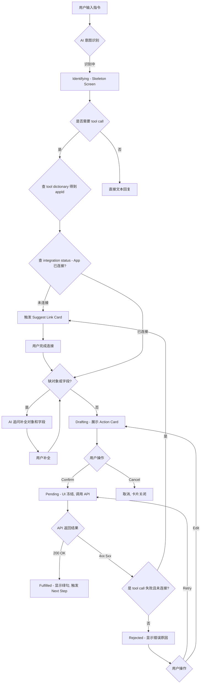
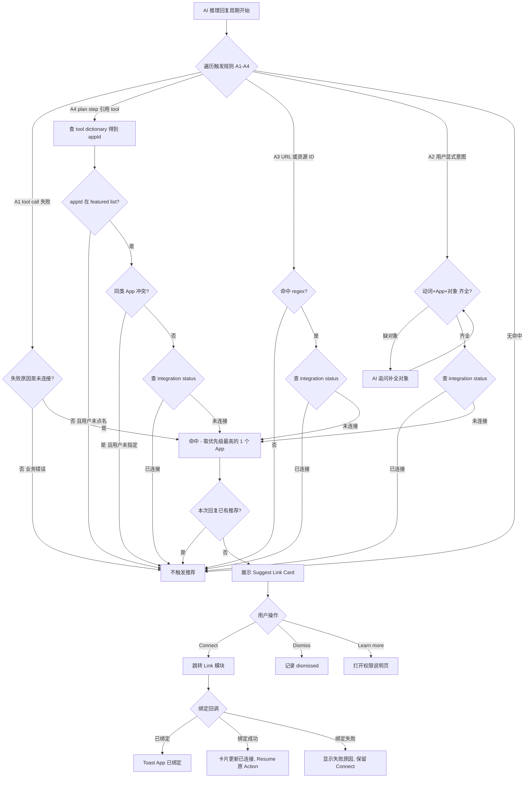
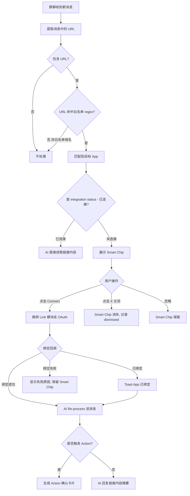

## 1. 背景与目标

### 1.1 背景
Phase 1 完成了数据 Ingest（摄入），但存在两个核心痛点：
- 闭环缺失：用户只能“查”不能“改”，导致 Tanka 无法进入核心业务流
- 连接动力不足：用户（含内部员工）缺乏主动连接数据源的动力，导致数据孤岛

### 1.2 Phase 2 核心目标
构建 "Ingest <-> Reason <-> Act" 的完整闭环：
- Action Loop：支持 API 回写和消息分发，让 AI 真正干活
- Active Guidance：利用“连锁反应”和“场景识别”，在用户最需要的时候引导连接，解决 Link 率低的问题

## 2. 通用 Action 样式 (Action Abstraction)

**Action Card 流程图**

### 2.1 Action 类型与开发方案
| Action 类型 | 样例 | 主要开发方案 |
| --- | --- | --- |
| API 更新 | HubSpot, Jira, Linear | 对齐统一 API schema 后进行字段更新与写入 |
| 消息发送 | Slack, Gmail, Outlook | 使用统一消息模板审核与发送，交互与 Work 当前消息一致 |
| Generation | 可灵, nano banana | 小助手中直接进行多模态生成 |
| 深度开发 | Zoom | 按业务需求进行单独开发与工作流适配 |
| 结构化数据库 | HubSpot 查询, Airtable 查询 | 通过 AI coding 生成查询代码 |

为了支持未来更多扩展 App，需要抽象 3 种标准交互模板，而不是为每个 App 单独写 UI。  
Figma 参考：https://patron-carry-41930208.figma.site

### 2.2 Type A: State Mutation Card（状态变更型）
适用场景：Update Jira Status, Change HubSpot Deal Stage, Mark Linear Issue as Done  
交互逻辑：Read Current State -> Propose New State -> Confirm

**UI 结构**
- Header：App Icon + "Update Status"
- Body：左右对比视图（Diff View），示例：To Do (灰) -> In Progress (绿)
- Footer：`[ Confirm Update ]`

**状态流转**
Drafting -> User_Interaction -> Pending -> Fulfilled / Rejected

**状态说明**
| 状态 | 触发条件 | 前端交互与视觉逻辑 | Tanka Native 特殊逻辑 |
| --- | --- | --- | --- |
| Identifying（识别中） | 用户输入指令 | Skeleton Screen：显示 "Thinking..." 或 "Identifying intent..."，不显示具体卡片 | - |
| Drafting（待确认/草稿） | 意图识别完成并获取 Current Value | Diff/Form View 展示当前值与建议值；Dropdown 可修改；按钮 `[Confirm]` / `[Cancel]` | Work Session：展示 "Open Session" 按钮并预览 Context；Agent Workflow：展示任务计划 |
| Pending（执行中） | 用户点击 Confirm | UI 冻结（Disabled）；按钮 Spinner；支持 Optimistic UI | Agent Workflow：进入 Live Progress，显示步骤日志；提供 `[Stop Generation]` |
| Fulfilled（执行成功） | 接口返回 200 OK | 静态卡片；显示绿勾与 "Updated just now"；触发 Next Step 提示 | Work Session：卡片消失并自动跳转；Agent Workflow：显示最终产出摘要/链接 |
| Rejected（执行失败） | 接口返回 4xx/5xx | 显示红色警告与错误原因；按钮变为 `[Retry]` / `[Edit Parameters]` | Agent Workflow：显示断点，允许人工反馈后 Resume |

**常用 Action 案例**
| 样式 | 应用列表样例 | 相关场景 | 开发状态 |
| --- | --- | --- | --- |
| CRM | HubSpot | Update Deal Stage；Update Contact；Log Activity | - |
| 任务管理 | Linear, Jira | Status Change；Assignee Update；Priority Change | - |
| 文档同步 | Confluence, Notion, Google Doc | 创建文档；更新文档内容 | - |
| 日程同步 | Google Cal, Outlook Cal | 发送日程 | - |
| 会议生成 | Zoom, Google Meeting | Instant Meeting：生成会议链接并发送 | - |
| Tanka Work | Tanka 内生 Work 模块 | AI 对话后自动开启 Work Session；挂起 Agent 工作流；深度调研与生成内容 | - |

### 2.3 Type B: Content Dispatch Card（内容分发型）
适用场景：Send Slack Message, Draft Email (Gmail), Reply to Intercom, Tweet  
交互逻辑：Generate Draft -> Preview -> Send

**UI 结构**
- Header：App Icon + "Draft Message"
- Body：引用框或缩略图  
  - Subject：Re: Project X  
  - Content："Here is the summary..."（支持点击展开编辑）
- Footer：`[ Send Now ]` | `[ Edit ]`

### 2.4 Type C: Resource Allocation Card（资源调度型）
适用场景：Schedule Zoom Meeting, Create Google Calendar Event, Book Resource  
交互逻辑：Check Availability -> Propose Slot -> Book

**UI 结构**
- Header：App Icon + "Schedule Event"
- Body：时间胶囊 + 人员列表  
  - 📅 Jan 20, 2:00 PM (30m)  
  - 👥 David, Sarah, +AI
- Footer：`[ Send Invite ]`

## 3. Active Link Recommendation（智能连接引导）
功能定义：基于“场景缺失”的主动推荐，分为两种落地形态（Surface）：
- Assistant 建议（基于任务流/计划依赖/执行失败）
- Group Chat 识别（基于 URL 正则）

### 3.0 设计原则（低幻觉优先）
参考 Gemini 的连接提示卡，本期只做“**可验证证据**”驱动的推荐：
- **先证据，后推荐**：必须能指出“为什么推荐连接”（来自系统状态/错误信息/URL 命中/计划依赖）
- **不猜测用户目的**：不基于用户身份、偏好或模糊主题做推断
- **低风险动作**：卡片提供 `Learn more` / `Connect`，不自动执行写入类操作

### 3.0.1 数据来源与状态定义（工程约束）
- **Integration status 接口**：存在 `integration status` 查询接口（用于判定“未连接/已连接”）
- **缓存**：连接状态有缓存；进入绑定流程或绑定完成回调时需重新查一次最新状态
- **连接粒度**：连接为 **user 级**；推荐与展示均基于“当前 user”的连接状态
- **绑定完成后的回流**：OAuth/Link 完成后回到 AI 小助手；推荐卡更新为“已连接”，随后 **Resume 原 Action**，AI 继续推理流程

### 3.0.2 频控与轰炸防护（必须）
- **单次 Assistant 回复最多 1 个推荐**：在一次 AI 推理/回复周期内，只允许弹出 **1 张**连接建议卡（或 1 段连接建议文本）
- **多候选只取第一个**：若同一回复内命中多个 App，仅推荐排序后的第一个（见 3.1.4）

### 3.0.3 Tool Dictionary（参考 MCP tools 的推荐逻辑）
目标：让 A4（Plan/Workflow 依赖）与 Action 推荐一致，避免模型“凭空猜工具/猜 App”，统一由后端维护的“工具字典”驱动推荐。

**核心思路**
- 每个 connector/MCP tool 都有一个统一的“最小描述（mini spec）”，包含：工具做什么、对应哪个 App、典型对象与能力边界
- Agent 生成的结构化 plan steps 里只要出现 tool 引用，就可以通过 tool dictionary **确定性映射**到目标 App
- 当映射到的 App 未连接时，触发 A4 推荐（并在 Why 里引用 step 文本/工具描述）

#### 3.0.3.1 Tool Dictionary 最小字段（建议）
| 字段 | 含义 | 示例 |
| --- | --- | --- |
| `toolId` | 工具唯一 ID | `google.calendar.create_event` |
| `displayName` | 展示名（多语言可选） | `Create Calendar Event` |
| `shortDescription` | 统一最小描述（给模型与 UI） | `Create/Update calendar events in Google Calendar.` |
| `appId` | 归属 App（用于 link 推荐） | `google_calendar` |
| `category` | 工具类别 | `calendar` / `email` / `drive` |
| `objects` | 该工具涉及的对象（用于 A2/A4 对齐） | `[calendar_event]` |
| `requiresIntegration` | 是否需要连接 | `true` |
| `evidenceTemplate` | Why 模板（可选） | `Step requires <App> tool: <toolId>` |

#### 3.0.3.2 Plan step 与工具映射（A4）
- Plan 为结构化 steps（agentic workflow schema）
- 每个 step 使用 `tool_name` 引用工具（与 MCP tools 的命名体系一致）
- 触发 A4 时，从 step 提取 `tool_name` -> 查 tool dictionary -> 得到 `appId` -> 查 integration status

**同类 App 冲突（抑制规则）**
- 若同一个“能力类别”存在多个可选 App（例如 code repo: GitHub/GitLab），且用户未明确点名 App，则 **不触发 A4 推荐**
- 本期优先对 3.5 featured apps 做 A4 推荐（可控、低幻觉）

#### 3.0.3.3 数据来源（工程需要提供）
- `tool dictionary`：后端维护，通过 **agent API** 提供查询；agent runtime 本地缓存一份（建议支持 `version` 字段与 TTL；TTL 先按工程默认值，后续可调）
- `plan steps`：agent runtime 生成并可回传前端用于展示证据片段（可展开）

### 3.1 本期实现范围：A 档场景识别（仅做 1-4）
触发推荐的前置条件：**目标 App 未连接/未授权**（系统状态可查）且命中以下任一规则。

| 规则 ID | 场景（低幻觉） | 触发信号（必须可验证） | 推荐输出（卡片内容要点） |
| --- | --- | --- | --- |
| A1 | 工具/Action 执行失败指向未连接 | **只看调用失败**（connector/tool call 失败）且系统状态显示未连接；若是业务参数错误/内容错误导致失败，则不触发 | Surface=Assistant：用文本提示 + 引导 Connect；Why：引用失败原因（或“未连接状态”） |
| A2 | 用户显式意图 + 明确应用名/对象 | 用户原话或可验证上下文中同时出现：动词 + App + 对象（见 3.5 对象词典）；**缺对象则不触发推荐**，改为追问对象/操作字段补全 | Why：引用用户原话关键片段；Action：`Connect` |
| A3 | 可验证的 URL/资源标识出现 | 命中 URL Regex（见 3.3）或出现资源 ID（如 Jira `ABC-123`、Linear `TAN-123` 等） | Why：`To open/read this link, connect <App>`；Action：`Connect` |
| A4 | Agent 计划步骤明确依赖某集成 | Plan/Workflow 中出现明确步骤：`Fetch from <App>` / `Update <App>` / `Send via <App>`，且系统状态显示该 App 未连接 | Why：引用 plan 步骤（例如 “Step 2: Fetch Jira issue …”）；Action：`Connect` |

**冲突处理（多规则同时命中）**：一次只推荐 1 个 App，优先级：A1 > A4 > A3 > A2。  
**冷启动兜底**：如无法抽取证据片段（Why），则不出卡（避免“黑盒推荐”）。

#### 3.1.4 多候选排序逻辑（只推荐第一个）
目标：避免一个回答出现多个连接建议造成轰炸，同时保持可控、低幻觉。
- **优先级**：A1 > A4 > A3 > A2（同 3.1）
- **同优先级内**：
  - A4：按 Agent 结构化 step 顺序，取 **最先需要的 connector tool** 对应的 App
  - A3：按消息中 URL 出现顺序，取第一条命中的 App
  - A2：按用户显式指定的 App（若多 App 同时出现，取语句中最先出现的；仍只出 1 张卡）
- **冲突/歧义抑制**：
  - 若 step 属于“同类 App 冲突”（例如代码仓库 GitHub vs GitLab）且用户未明确指定 App，则 **不推荐**（避免幻觉）
  - 本期仅对 3.5 的 featured apps 做强推荐；非 featured apps 必须用户明确点名才触发 A2/A4

#### 3.1.1 推荐卡片 UI 模板（参考 Gemini）
- Header：`<App Icon> <App Name>`
- Title：`Connect <App> to continue`
- Description（价值陈述，固定模板）：`Connect to enable read/write access for this step.`
- Why（必须展示证据）：从 A1-A4 的触发信号中抽取 1 条（错误原因/URL/plan step/用户原话片段）
- Actions：
  - `Learn more`：打开权限说明/将解锁的能力说明（静态页面即可）
  - `Connect`：拉起 OAuth/授权流程

#### 3.1.2 防幻觉约束（必须遵守）
- 卡片文案中不得出现“你可能/应该/我猜你想…”等推断性表达
- 不得以“业务常识”补全缺失信息（例如没看到 Jira 链接就说“你在做 bug 所以需要 Jira”）
- 不得承诺连接后一定能完成任务（只说“解锁能力/继续执行该步骤”）

#### 3.1.3 事件埋点（用于评估推荐质量）
- `link_suggested`: { ruleId, app, evidenceType, evidenceSnippet, surface: assistant|groupChat, connectedBefore: boolean }
- `link_clicked`: { ruleId, app }
- `link_connected`: { ruleId, app, success: boolean, errorCode? }
- `link_dismissed`: { ruleId, app }

### 3.2 Surface 1：Assistant（任务流引导）

**Suggest Link Card 流程图（Assistant Surface）**

典型场景：
- A1：执行某个 Action（如 “Send Email via Gmail”）失败，错误显示未授权
- A4：Agent plan 明确需要调用某 App，但系统状态显示未连接
- A2：用户明确提出“在 Jira 建 issue / 发 Slack 给团队”等意图，但检测到未连接

**UI 组件**
- Prompt：`Suggest link to continue`（带 ✨ 图标）
- Card（同 3.1.1 模板）：展示 Why（证据）+ `Learn more` / `Connect`

**A1 的交互补充（工程实现）**
- **失败后呈现形式**：在 chat stream 里用一段 AI 文本说明“未连接，无法调用工具”，并附带 1 个 Connect CTA（或 1 张 link card）
- **成功后行为**：绑定完成回到小助手，卡片更新为“已连接”，系统自动 **Resume 原 action**，AI 继续推理/执行
- **失败/重复绑定处理**：进入绑定流程时重新查 status；若发现已绑定，toast：`<App> 已绑定 <账号>`，随后回到“已连接/继续执行”状态

### 3.3 Surface 2：Group Chat URL Regex Trigger（群聊正则引导）

**Suggest Link in Group Chat 流程图**

Figma 参考：https://raid-amused-82466186.figma.site

场景：用户在群里发送链接，AI 无法读取链接内容  
Trigger：实时监听群消息，匹配高频 SaaS 工具 URL 规则（Link Formula）

**白名单约束**
- 不在白名单域名/regex 命中列表内：本期 **不触发** 推荐（避免误判）

**绑定入口**
- Smart chip 点击后跳转到 Link 模块对应 App 的 Connect 按钮，走与当前 Link 页面一致的 OAuth / API Link 流程
- 绑定完成后触发对该消息的 **Re-process**，并生成后续 Action 的“确认卡片”（Drafting -> Confirm）

| App / Category | Regex Pattern（正则） | 示例 URL | Smart Chip Copy |
| --- | --- | --- | --- |
| Google Docs | `https?:\/\/(docs\.google\.com\/(?:a\/[^\/]+\/)?document\/d\/)[a-zA-Z0-9-_]+` | docs.google.com/document/d/1A2b... | 📝 Link Docs to read content |
| Google Sheets | `https?:\/\/(docs\.google\.com\/(?:a\/[^\/]+\/)?spreadsheets\/d\/)[a-zA-Z0-9-_]+` | docs.google.com/spreadsheets/d/1xY... | 📊 Link Sheets to analyze data |
| Google Slides | `https?:\/\/(docs\.google\.com\/(?:a\/[^\/]+\/)?presentation\/d\/)[a-zA-Z0-9-_]+` | docs.google.com/presentation/d/1Z... | 📽️ Link Slides to view deck |
| Google Drive | `https?://(drive.google.com/(?:drive/)?(?:folders/u/0/folders/))[a-zA-Z0-9-_]+` | drive.google.com/drive/folders/0B... | 🔗 Link Drive to open folder |
| Notion | `https?://(?:www.)?(?:notion.so|notion.site)/(?:[a-zA-Z0-9-]+/)?[a-zA-Z0-9-]+` | notion.so/my-workspace/page-id... | 🔗 Link Notion to open page |
| Figma | `https?://(?:www.)?figma.com/(?:file|proto|design)/[a-zA-Z0-9]+` | figma.com/file/Abc123... | 🔗 Link Figma to view file |
| Zoom | `https?://(?:[a-zA-Z0-9-]+\.)?zoom.us/(?:j|my|wc)/[a-zA-Z0-9]+` | zoom.us/j/123456789 | 🔗 Link Zoom to open meeting |
| Miro | `https?:\/\/(?:www\.)?miro\.com\/app\/board\/[a-zA-Z0-9-_=]+` | miro.com/app/board/uXjVOo... | 🧠 Link Miro to view whiteboard |
| Loom | `https?:\/\/(?:www\.)?loom\.com\/share\/[a-z0-9]+` | loom.com/share/e94d... | 🎬 Link Loom to watch video |
| Airtable | `https?:\/\/(?:airtable\.com)\/(?:[a-zA-Z0-9]+\/)?(app[a-zA-Z0-9]+)` | airtable.com/appXyZ123/tbl... | 🗃️ Link Airtable to sync base |
| Linear | `https?://(?:linear.app)/[a-zA-Z0-9-]+/(?:issue|project)/[a-zA-Z0-9-]+` | linear.app/tanka/issue/TAN-123 | 🔗 Link Linear to view issue |
| Jira | `https?:\/\/[a-zA-Z0-9-]+\.atlassian\.net\/browse\/[a-zA-Z0-9-]+` | company.atlassian.net/browse/PROJ-1 | 🐛 Link Jira to track ticket |
| Confluence | `https?:\/\/[a-zA-Z0-9-]+\.atlassian\.net\/wiki\/spaces\/[a-zA-Z0-9]+\/pages\/[0-9]+` | company.atlassian.net/wiki/spaces/... | 📘 Link Confluence to read spec |

**Interaction（交互设计）**
- Smart Chip（胶囊提示）：在包含链接的消息气泡右下方或正下方，显示一个微型 Bar
- UI：✨ Link <App> to open this link [Logo] [x]
- Behavior：点击后直接弹出 OAuth 授权窗，授权完成后 AI 自动读取该链接内容并 Re-process 该消息

### 3.4 非本期范围（先记录，不做）
以下为更“聪明”但更不可控的触发方式，本期不做，仅记录在 PRD 里：
- B 档：任务类型强相关但缺少明确 App（需要澄清/多选）
- C 档：仅靠用户角色、历史偏好、模糊主题进行推断（高幻觉风险）

### 3.5 Featured Apps（本期覆盖）与对象词典（A2 门槛用）
本期优先覆盖以下 featured apps（可控、常用、低幻觉）：
- Google Calendar
- Outlook Calendar
- OneDrive
- Gmail
- Outlook（Email）
- Notion
- Google Drive
- Google Sheets
- Google Docs
- Google Slides
- Zoom

#### 3.5.1 中英对象词典（Object Dictionary）
说明：A2 必须满足 “动词 + App + 对象”。对象可来自用户原话或可验证上下文（例如已生成的 action draft / plan step）。

| Object key | 中文（可命中词） | English (aliases) | 典型适用 App |
| --- | --- | --- | --- |
| calendar_event | 日程、事件、日历事件、会议日程、邀约 | event, calendar event, invite | Google Calendar, Outlook Calendar |
| meeting | 会议、视频会议、Zoom 会、会议链接 | meeting, video meeting, call | Zoom（也可被 Calendar 触发为 event） |
| email | 邮件、邮件内容、邮件草稿、回信 | email, mail, draft, reply | Gmail, Outlook |
| thread | 邮件线程、会话、往来邮件 | thread, conversation | Gmail, Outlook |
| file | 文件、附件、文档文件 | file, attachment | OneDrive, Google Drive（以及 Docs/Sheets/Slides 作为 file） |
| folder | 文件夹、目录 | folder, directory | OneDrive, Google Drive |
| document | 文档、文章、Doc | doc, document | Google Docs |
| spreadsheet | 表格、Sheet、电子表格 | sheet, spreadsheet | Google Sheets |
| presentation | 幻灯片、PPT、Slides | slides, deck, presentation | Google Slides |
| notion_page | Notion 页面、页面、笔记 | page, note | Notion |
| notion_database | Notion 数据库、表格数据库 | database, collection | Notion |

#### 3.5.2 A2 缺对象时的行为（不推荐 link）
若用户只提到“动词 + App”但未说明对象（或对象字段不完整）：
- 小助手先反问补全对象/操作字段（例如“你要更新哪个日程？要修改哪一项？”）
- **补全完成**并形成可展示的 action draft/确认卡后，再根据连接状态决定是否推荐 Connect

### 3.6 指标与评估（本期）
- **打扰度**：推荐次数分布、每会话/每用户的 link_suggested 频率、dismiss 率
- **转化**：link_clicked -> link_connected 转化率
- **效果提升**：连接后任务成功率/完成率是否提升（连接前 vs 连接后）
